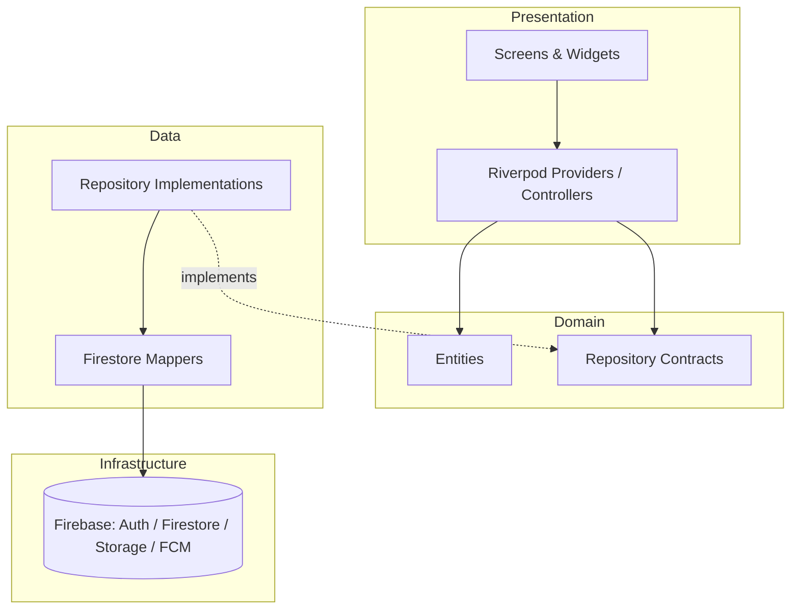
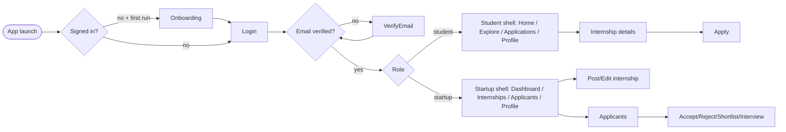
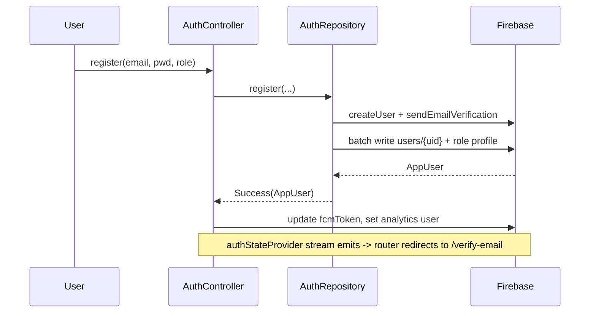
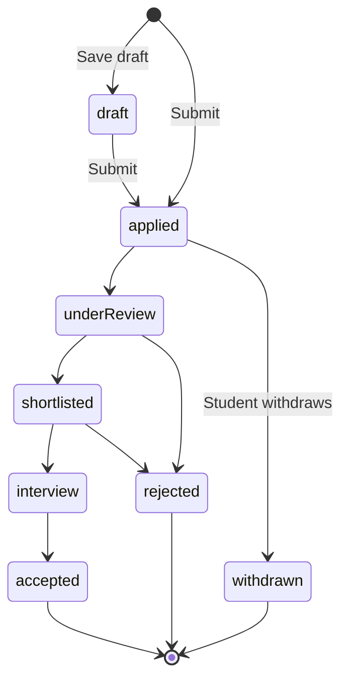
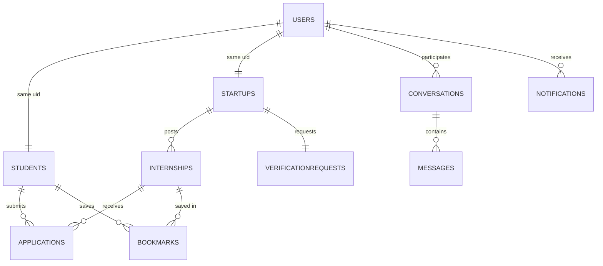
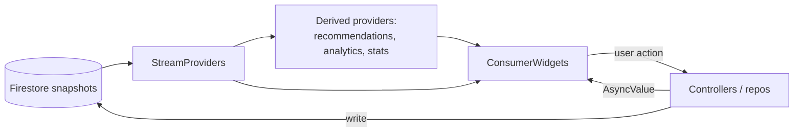

# Architecture diagrams

## Project / layer architecture

```mermaid
flowchart TB
  subgraph Presentation
    UI[Screens & Widgets]
    RP[Riverpod Providers / Controllers]
  end
  subgraph Domain
    ENT[Entities]
    RC[Repository Contracts]
  end
  subgraph Data
    IMPL[Repository Implementations]
    MAP[Firestore Mappers]
  end
  subgraph Infrastructure
    FB[(Firebase: Auth / Firestore / Storage / FCM)]
  end
  UI --> RP --> RC
  IMPL -.implements.-> RC
  RP --> ENT
  IMPL --> MAP --> FB
```

## Navigation flow

```mermaid
flowchart LR
  Start([App launch]) --> Auth{Signed in?}
  Auth -- no + first run --> Onboarding --> Login
  Auth -- no --> Login
  Login --> Verify{Email verified?}
  Verify -- no --> VerifyEmail --> Verify
  Verify -- yes --> Role{Role}
  Role -- student --> SHome[Student shell: Home / Explore / Applications / Profile]
  Role -- startup --> SDash[Startup shell: Dashboard / Internships / Applicants / Profile]
  SHome --> Details[Internship details] --> Apply
  SDash --> Manage[Post/Edit internship]
  SDash --> Applicants --> Decision[Accept/Reject/Shortlist/Interview]
```

## Authentication flow

```mermaid
sequenceDiagram
  participant U as User
  participant A as AuthController
  participant R as AuthRepository
  participant FB as Firebase
  U->>A: register(email, pwd, role)
  A->>R: register(...)
  R->>FB: createUser + sendEmailVerification
  R->>FB: batch write users/{uid} + role profile
  FB-->>R: AppUser
  R-->>A: Success(AppUser)
  A->>FB: update fcmToken, set analytics user
  Note over A,FB: authStateProvider stream emits -> router redirects to /verify-email
```

## Application workflow

```mermaid
stateDiagram-v2
  [*] --> draft: Save draft
  [*] --> applied: Submit
  draft --> applied: Submit
  applied --> underReview
  underReview --> shortlisted
  shortlisted --> interview
  interview --> accepted
  underReview --> rejected
  shortlisted --> rejected
  applied --> withdrawn: Student withdraws
  accepted --> [*]
  rejected --> [*]
  withdrawn --> [*]
```

## Database relationships

```mermaid
erDiagram
  USERS ||--|| STUDENTS : "same uid"
  USERS ||--|| STARTUPS : "same uid"
  STARTUPS ||--o{ INTERNSHIPS : posts
  INTERNSHIPS ||--o{ APPLICATIONS : receives
  STUDENTS ||--o{ APPLICATIONS : submits
  STUDENTS ||--o{ BOOKMARKS : saves
  INTERNSHIPS ||--o{ BOOKMARKS : "saved in"
  USERS ||--o{ CONVERSATIONS : participates
  CONVERSATIONS ||--o{ MESSAGES : contains
  USERS ||--o{ NOTIFICATIONS : receives
  STARTUPS ||--|| VERIFICATIONREQUESTS : requests
```

## State management flow

```mermaid
flowchart LR
  FS[(Firestore snapshots)] --> SP[StreamProviders]
  SP --> Derived[Derived providers:\nrecommendations, analytics, stats]
  SP --> UI[ConsumerWidgets]
  Derived --> UI
  UI -- user action --> Ctrl[Controllers / repos]
  Ctrl -- write --> FS
  Ctrl -- AsyncValue --> UI
```
